# Operationalising Machine Learning

This project aims to implement a machine learning pipeline through the following key steps (as illustrated through the Architectural Diagram) to classify a banking data set as provided through the UCI depository for a classification model.
* Authentication
* AutoML Model
* Deploy the Best Model
* Enable Logging
* Swagger Documentation
* Consume Endpoints
* Create and Publish a pipeline
* Documentation

## Architectural Diagram
The following image illustrates the proposed architecture for the project.
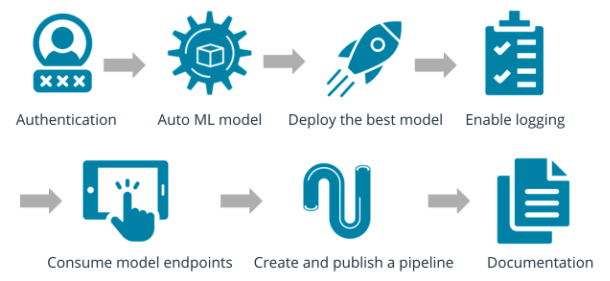

FIG 1 - PROJECT ARCHITECTURE

* Authentication: Create a Security Protocol within the Azure Workspace
* AutoML Model: Use AutoML to compare suitable models against the preferred classification metric
* Deploy the Best Model: Once the best model is selected, it is then deployed
* Enable Logging: Logging for use and potential errors through out its deployment
* Swagger Documentation: 
* Consume Endpoints: 
* Create and Publish a pipeline: The process is automated using a pipeline.
* Documentation

## Key Steps
### Authentication
This step was not used as the Udacity VM account was used for modelling.

### AutoML Model
The intent of AutoML is to essentially automate Machine Learning activities.  This is provided through Azure as a predefined process, and allows the user to select between classification and regression as an output.  To simply activities as well you can choose whether or not to include deep learning and or what models can be excluded from the process.

The first steps required to execute this in Azure Machine learning is to provide a compute cluster, the computing engine that provides the capabilty to analyse the dataset through a series of typical machine learning process's.  For this project, the intial step was to create a compute cluster using the Standard_DS12_v2 (virtual machine which provides scalability depending on the criticality/difficulty of the problem) as per the assignments criteria.

Given there is a cost associated with this, there is a watchout for users and included in this assignment to provide a suitable time out period and max amount of compute power to allocate.  If left unchecked, this could be an expensive assignment.  From here the data set is provided.  This can be linked from a URL (as per the Jupyter notebook) or uploaded as a CSV which was the case for simplicity for this project.

The dataset provided, was located from the UCI depository as per the attached link.
https://automlsamplenotebookdata.blob.core.windows.net/automl-sample-notebook-data/bankmarketing_train.csv

The dataset consists of 20 variables including numeric (integer and decimal) and categorical (strings) and one target variable "y" which is a categorical variable for classification indicating whether or not the target applicant was given a loan.

The dataset was loaded into Azure Machine Learning as a tabular dataset.

## Filename 
BankDataset

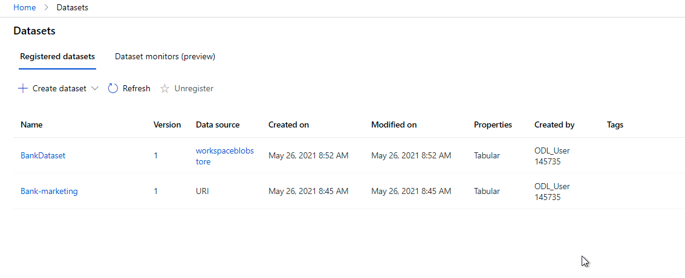

FIG 2 - CREATE BANK DATASET - REGISTERED DATASETS

FIG 3 - CREATE BANK DATASET - DATASET EXPLORED

An experiment was run with Classification, ensuring Explain best model is checked, and the Exit Criteria was changed to reduce the default (3 hours) to 1 and reduce the Concurrency from default to 5.  AutoML was left to run.

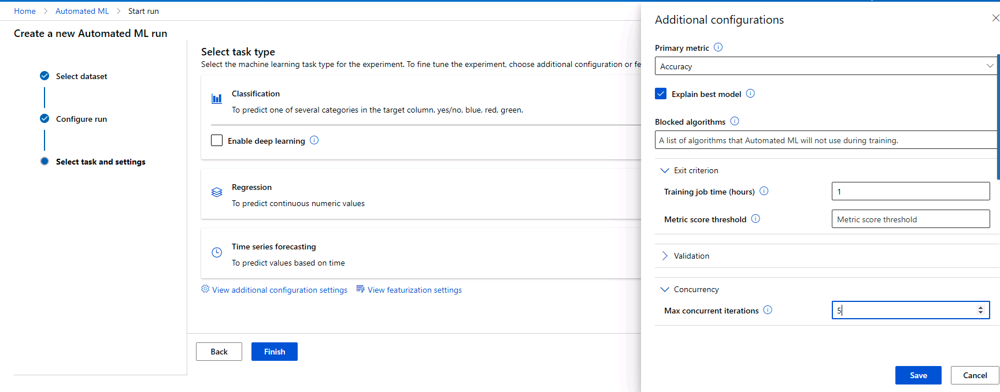

FIG 4 - AUTOML PROCESS SETUP

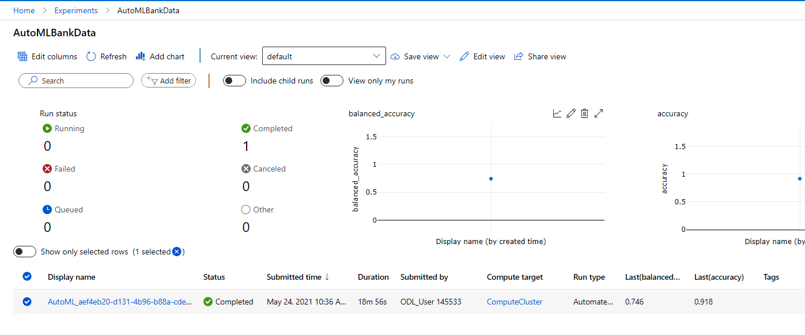

FIG 5 - AUTOML PROCESS COMPLETED - EXPERIMENT COMPLETE

The best performing model was VOTINGENSEMBLE
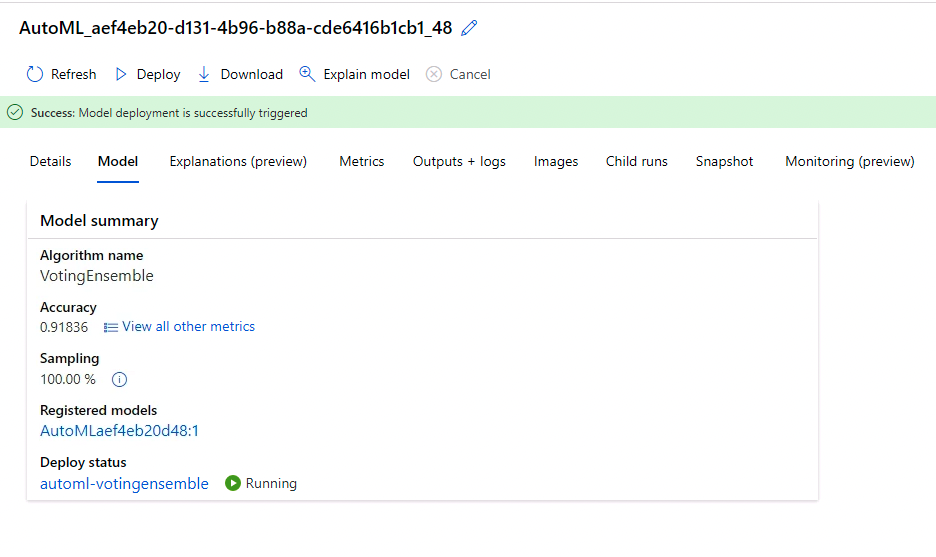

FIG 6 - BEST PERFORMING MODEL

### Deploy the Best Model
An Machine Learning Engineer links datascience (insights) into actionable outcomes.  A key component of this is determining when and just as importantly how to ship a model into production.  After developing and fine tuning the model, the best model should selected for deployment into production.  After selecting the best model, the next step is to deploy the model so that we can provide an API URL.  This step also requires consideration into authentication types to ensure security.  This includes call durations as well as errors to help determine whether or not you have applied the correct resources to the model.

To do this through Azure Machine Learning, through the Model tab, you find the best previously trained model and deploy it with the appropriate authentication.  In the case of this project the authentication uses Azure Container Instance (ACI), with authentication enabled.  Deploying the model allows us to access the model enpoint.

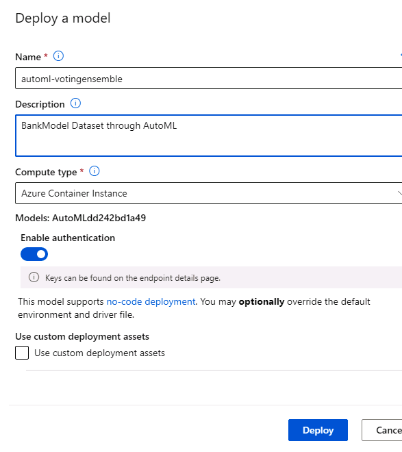

FIG 7 - DEPLOY MODEL ACI

### Enable Logging
After deploying a model, enabling logging allows information into how the deployed service is behaving and helps determine irregularites in deployment/production.  Azure Applications Insights is the proposed method used to determine these irregularities.  To execute this the config.json file is downloaded from the Azure primary settings for the login/authentication details and is saved into the working directory to provide the appropriate subsription, resource ids etc for the work space which is used for logging.  The log.py file is changed where the name now reflects the deployed model.

To do so we have a logs.py python script that we can serve using gitbash as a terminal.  In this project this includes some minor modifcations to correctly enable logging (i.e. # enable application insight service.update(enable_app_insights = True).  This triggers an authenticaiton process that is enabled/approved in a web browser and confirmed through Applications Insights.

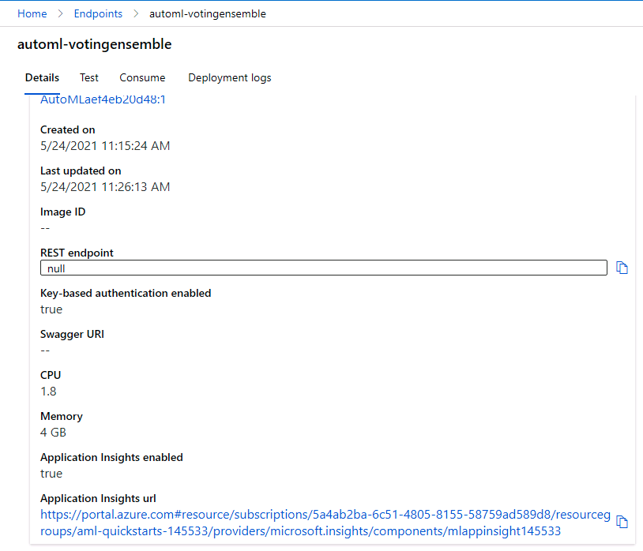

FIG 8 - APPLICATIONS INSIGHTS ENABLED

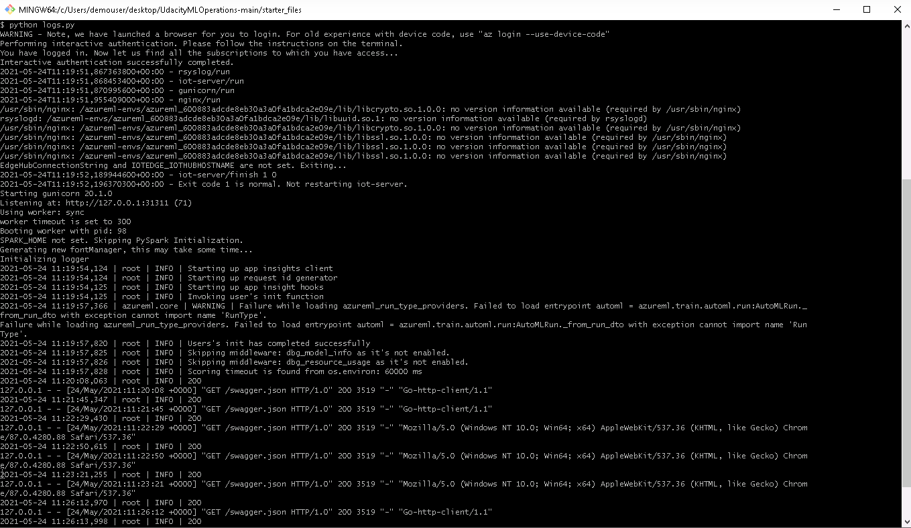

FIG 9 - LOGS.PY TERMINAL RUN - LOGS.PY SCRIPT

### Swagger Documentation
Once logging is enabled, and the model is deployed, you then go to endpoints and in the details tab download a copy of the Swagger URI to the Swagger folder in the start files script.  At the same time amend the swagger.sh file to change the port number above 9000.  Using gitbash as the terminal swagger.sh was run (bash swagger.sh and in a new terminal python serve.py was run.  Swagger documentation was enabled in the web browser.

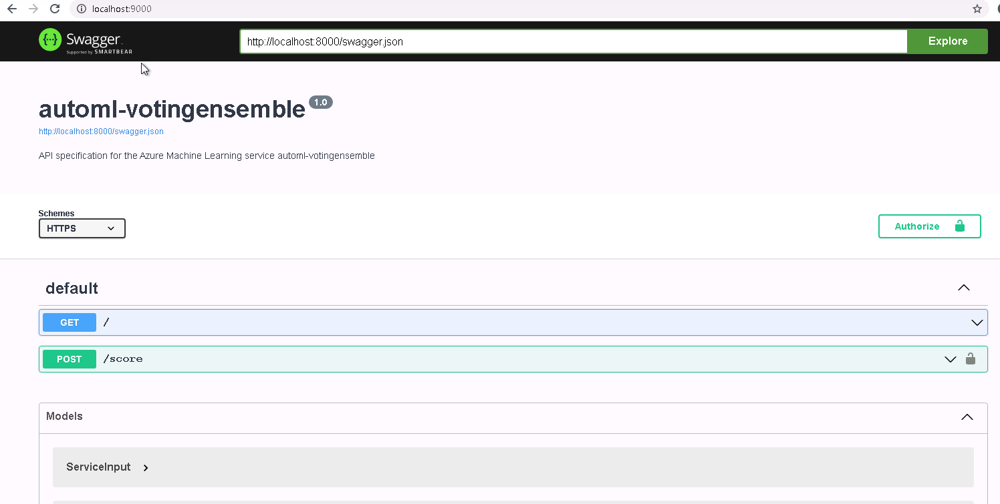

FIG 10 - SWAGGER RUNNING ON LOCALHOST SHOWING HTTP API

### Consume Endpoints
Creating a benchmark creates a baseline performance of the model.  The intent of this is to evaluate ongoing performance above what we would look for in anomalies.  Key questions regarding how well the model is performing allow the Machine Learning Engineer to whether fine tuning or modification to the original model is required.

Swagger is offered by Azure Machine Learning as part of its Endpoint offer to build, document and consume HTTP API's, which is a understanding tool to help understand what the API accepts including inputs (GET Requests) and outputs (POST Requests) as well as what the endpoints are.  This is important in larger teams, where its easier to communicate what the inputs the model is expecting for ideal performance and would be used if during interogation of the log input the model is crashing, perhaps the inputs are not compatible.  Simiarly this faciliates quicker understanding of what the proposed outputs are.

In the deploy model, when reviewing the consume tab, we copy the rest endpoint and the primary key (or secondary key) and modify the endpoint.py file located in the starter_files directory.

We then look to send through some data through to the scoring uri by running endpoints.py
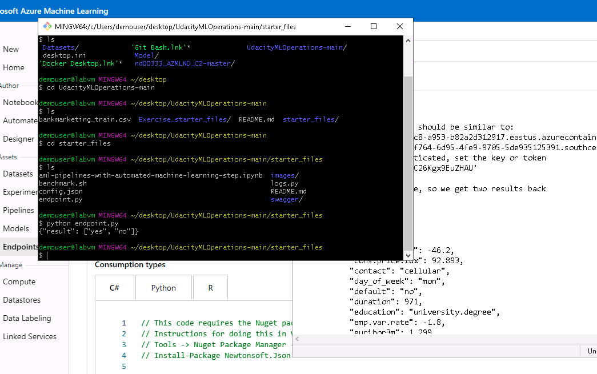

FIG 11 - ENDPOINT.PY TERMINAL SCRIPT

We then use the same score file and primary key to modify the benchmark.sh file and run it.  Modify the lines at the bottom of the code.
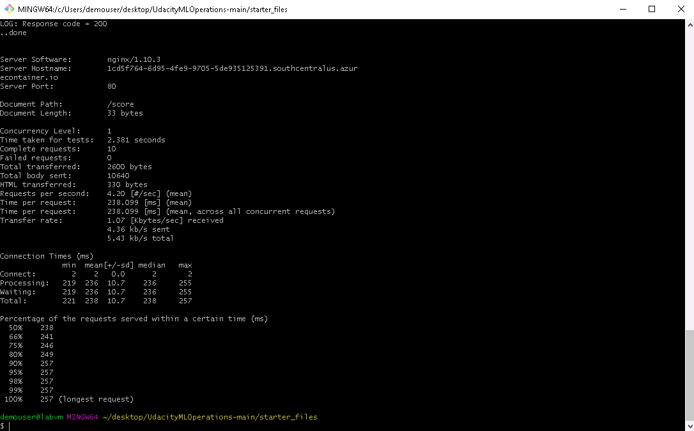

FIG 12 - BENCHMARK RUNS AGAINST HTTP API

### Create and Publish a pipeline
Using the provided jupyter workbook we look to publish a pipeline.  This takes several steps.
1. Create the pipeline
2. Publish the pipeline
3. Consumep the pipeline endpoint API.

To do this the provided notebook (jupyter was used).
The modified information for this automated pipeline is

* Dataset
* Compute Cluster
* 
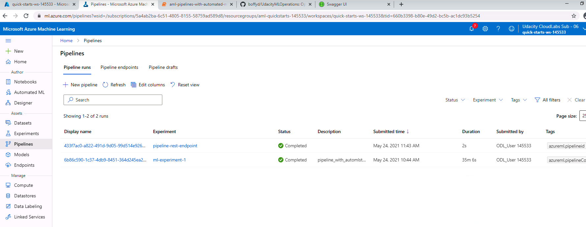
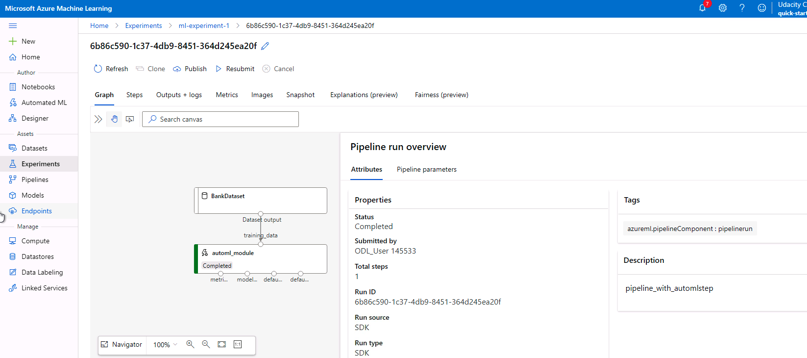
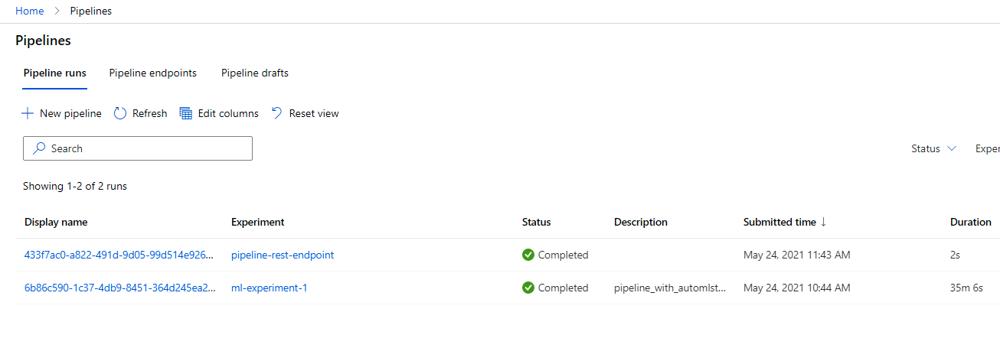

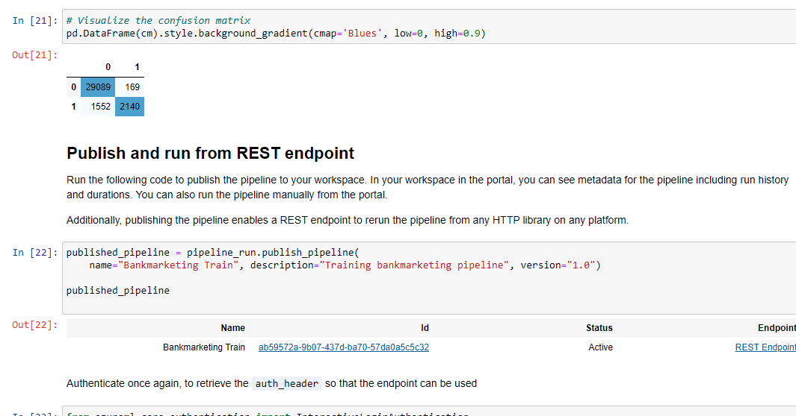
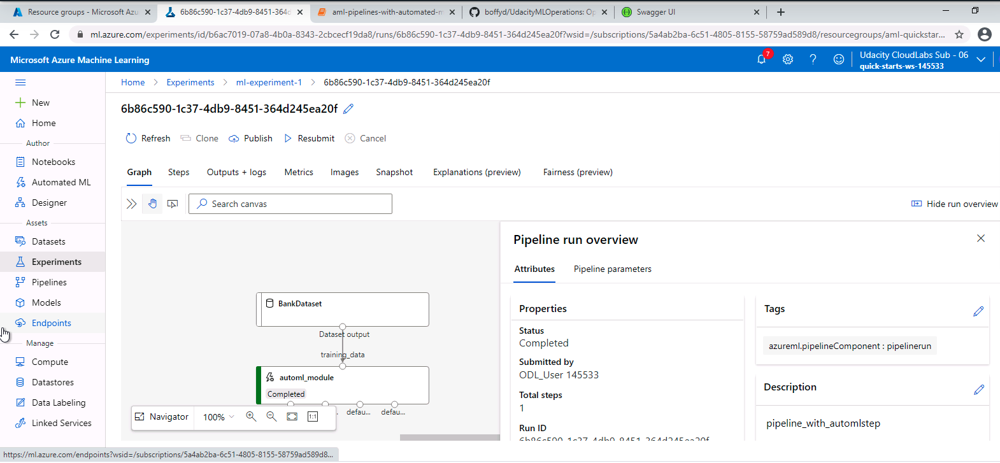
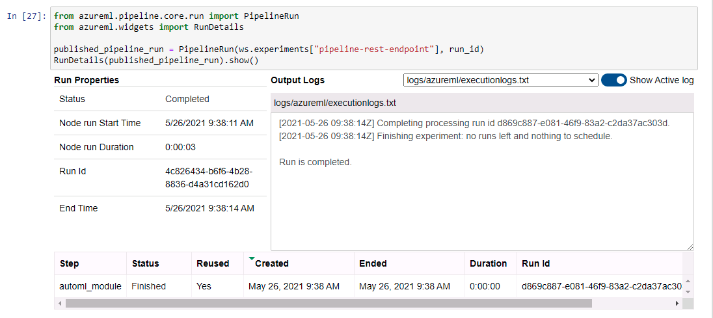
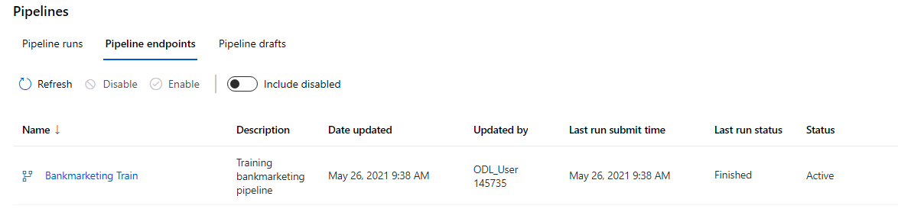
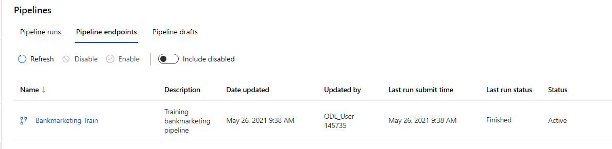
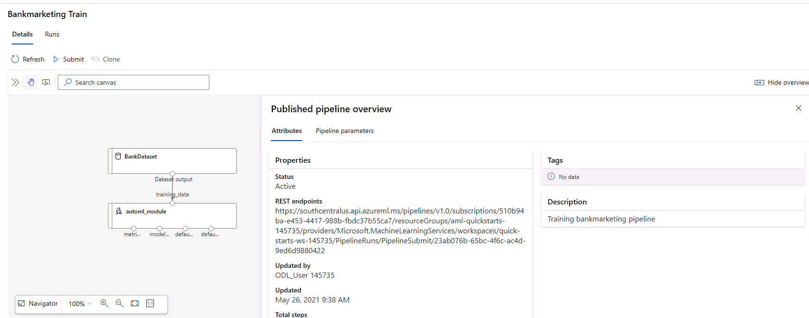
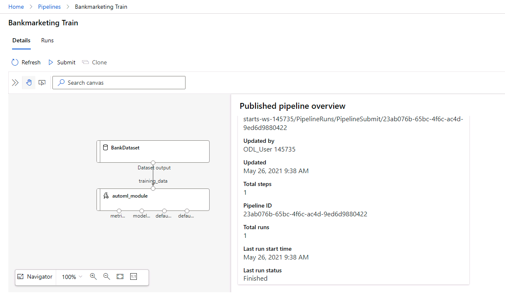

FIG 13-23 - PIPELINES

## Screen Recording
https://youtu.be/vyPnRQKSmz8

## Future Improvement Suggestions
Improvements would be further development of feature engineering, getting more data or potentially using deep learning which was ruled out due to the time involved in running the model.  The insights through Azure Machine Learning Studio indicate that the The model indicates a class imbalance which can be treated by various methods and may improve the model performance.

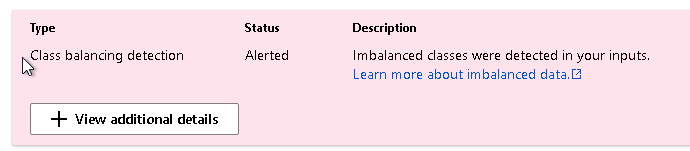

FIG 24 - CLASS IMBALANCE

